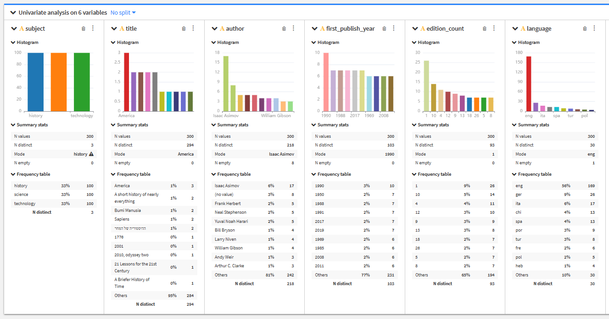

# Data Profile - Lab 5

## Source System
- **API**: Open Library 
- **Endpoint**: [Source](https://openlibrary.org/search.json)
- **API Documentation**: [Docs](https://openlibrary.org/dev/docs/api/search)
- **Parameters**: Subject and Limit
- **Authentication required**: No
- **Expected update frequency**: Monthly

## Raw Data Analysis
- Total rows fetched: 300
- Total columns: 6

|Column|Inferred Type|Nulls|Notes / Anomalies|
|:--|:--|:--|:--|
|subject|string|0|3 distinct categories - as defined.  no outliers|
|title|string|0|294 distinct tiles of 300 books.  Three books titled "America" - probably from the history category.|
|author|string|8|218 of 300 entries are distinct.  indicates repeat authors.  One author Isaac Asimov on 17 book rows|
|first_publish_year|bigint|0|Fairly evenly distributed.  No unexpected outliers|
|edition_count|bigint|0|Most books first edition but there are some books that are as high as 26th edition.  Seems a little strange to me but it might have to do with the book variety from the API or the subjects selected.|
|language|string|1|Most books are in english.  There are 30 distinct language categories, and 169 of the 300 are English.  THe rest are fairly small numbers - with german being 18 books as the next largest demographic|

## Cleaning Decisions

### Step 1
- Step name: Fill Empty Cells of AUthor with "Unknown"
- Why it was needed: 8 missing authors.  Rather than removing the rows, I opted to keep the books but list the author as Unknown.
- How many rows / values affected: 8 rows

### Step 2
- Step name: Remove rows with missing language information.
- Why it was needed: one row missing language.  Opted to remove this singluar entry.
- How many rows / values affected: 1 row

### Step 3
- Step name: Remove rows with 0 value in publish year
- Why it was needed: One row had a publish year of 0.  Chose to omit this row since there wasn't an accurate way to infer the year.
- How many rows / values affected: 1 row

### Step 4
- Step name: Format first_publish_year as date type with year as the format.
- Why it was needed: Ensuring the dates in this column are consistently formatted.
- How many rows / values affected: 0 rows.  This is more preventative for any misformatted date data that could be included in the future.

### Step 5
- Step name: Create publication era column for categorical analysis
- Why it was needed: The date information is continuous years, but grouping by eras is a way to allow for categorical analysis in the future.
- How many rows / values affected: 298 - all the rows

### Step 6
- Step name: Create book_age column
- Why it was needed: This is a relative interpretation of how old a book is in years.  This could mean more semantically than only relying on specific years.
- How many rows / values affected: 298 - all the rows.

## Storage Decisions
- Partition column chosen: subject
- Why this column: three subjects were chosen, each partition being a third of the data.  This allows for significantly less data needing to be processed.
- Row count after cleaning: 298
- Parquet file size (run: ls -lh data/processed/*/): 11kb (history) / 9.3kb (science) / 9.8kb (technology)

---

## Reflection Questions

- *You saved both raw_data.json and raw_data.csv in the raw zone. Why keep both? Under what circumstance would you need to go back to the JSON?*

raw_data.json is the full response object from the API call.  This is helpful if the design of the pipeline or analysis ever changes and different fields need to be used from the response.  This means less API calls are necessary.  It also holds the metadata from the response.  Both of these are use cases for revisiting the json file - looking at different parts of the data, and looking at any metadata from the API call.  The CSV file is simply the tabular data being used for the analysis/pipeline.

- *What did Dataiku's visual profile show you that df.describe() would not have surfaced as clearly?*

Dataiku provides a visual summary of the data allowing for quicker understanding of the data than the summary provided from the describe function.  It is easy with Dataiku to instantly see datatypes, missing values and distributions in a quick visual format.  While all the information you could need could be fetched without Dataiku - the purpose of Dataiku is to provide quick insights into the data by providing digestible graphical representations of the data.

- *Describe one specific cleaning step you applied and explain why it was necessary. What would have gone wrong in Lab 6 if you had not done it?*

I removed rows where the date was a value of 0.  It was only one row but if I didn't remove it then my added columns of book age and era wouldn't make sense.  That row would potentially be inaccurately categorized as pre 1900 because the year is listed as 0.  Similarly, book age would be 2026 years - also an inaccurate calculation.

- *You partitioned the Parquet output by a categorical column. How would your partition choice change if your dataset had 500 million rows instead of a few thousand?*

There would likely be even more specific partitions.  Instead of partitioning book subject only - it would be a combination of traits like subjects of a certain era with a certain language.  The partitions could be more thorough to narrow down a large amount of data into a much smaller manageable segment of relatively important data.

- *Your source is a public API with no SLA. Name two ways the source could change without warning that would break your pipeline, and how you would detect each.*

Although unlikely with an established API like Open Library, it is possible the Schema could change.  Maybe column names are changed, removed or added.  Because of this, it is best practice to validate the shape of the data as part of the API call process, and provide error messaging that indicates if the data isn't following an expected Schema.

A second problem could be certain API routes being deprecated or changed with future versioning - making old routes either obsolete, or providing outdated data.  Something that could be done to prevent this is to keep a record of what a typical response looks like, and as soon as the response either comes in in an unexpected way (think less data than expected for example), or the response object is empty, throw an error message that details the problem.